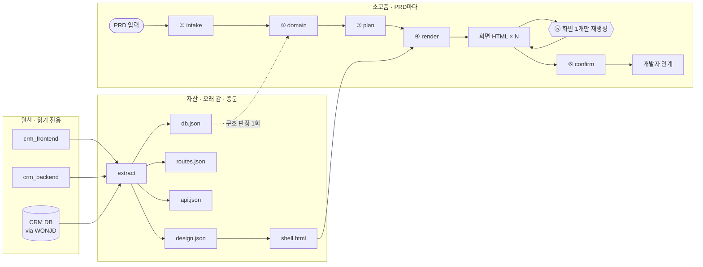

# Wireframe

비개발자가 자연어 PRD 하나만 넣으면, 기존 CRM 프론트·백·DB·디자인 자산 위에서
상세한 화면 HTML이 나온다. 마음에 들 때까지 화면 단위로 돌리고, 확정한 걸 개발자에게 넘긴다.

로컬이 1차 목표다. 파이프라인 본진은 **이 레포**. CRM은 읽기 전용 소스, WONJD는 DB 조회 도구,
Hermes는 CLI 껍데기만 둔다.

팀은 `/wireFrame`에서 본다.

## 왜

화면 디자이너가 없다. 요청이 이메일로 들어오고, 화면 없이 개발이 시작되니
UX가 어긋난다. 요청자가 **먼저 화면을 보고 고쳐서** 넘기면 그게 사라진다.

## 파이프라인

요청자가 만지는 md는 **PRD(`wireFrame/input/{run}.md`)뿐**이다.
`design.md` 등은 프로젝트 세팅 때 선택이다. 없으면 가정 잡고 `assumptions[]`에 남긴다.



자산은 코드/스키마가 바뀔 때만 다시 뽑는다. Run은 PRD → 무인 생성 → 화면 단위 반복 → 확정.  
DB 질의는 extract / domain 밖에서는 0회. 자세한 구현안: [PIPELINE.md](./PIPELINE.md) · [pipeline.html](./pipeline.html)

## 어디로 가나

와이어프레임은 **첫 번째 vertical**이다. 최종 목표는 도메인별 에이전트를 탭으로
관리하는 사내 도구고, 루프는 산출물 종류가 바뀌어도 같다 — 입력 · 무인 생성 ·
단위별 반복 · 확정 · 인계. 이름은 처음부터 중립 (`run` · `artifact` · `kind`).
자세한 건 [SPEC.md 확장](./SPEC.md#확장).

## 핵심

**자산과 소모품을 나눈다.**
코드베이스·DB에서 뽑은 규격(`projects/{slug}/`)은 오래 간다.
화면 HTML은 소모품이라 갈아엎는다. 자산이 안 흔들리니 20번을 돌려도 톤·구조가 유지된다.

**생성 단위는 산출물 1개다.**
지시한 화면만 다시 그린다. 잠금(`locked`)된 화면은 전체 재생성에도 유지한다.

**DB 질의는 반복 루프 밖이다.**
추출·구조 판정(`domain`)에서만 WONJD/DB를 본다. 화면 재생성 때는 `domain.json`만 읽는다.

**저장: 파일 + MySQL 메타. SQLite 없음.**
PRD·manifest·HTML은 파일(git). run/잠금/확정 공유용 메타만 MySQL.
로컬도 배포와 같은 MySQL을 쓴다 — SQLite로 우회하지 않는다.

## 문서

| | |
| --- | --- |
| [PIPELINE.md](./PIPELINE.md) | 로컬 구현 파이프라인 — 추출 · run · MySQL · CLI |
| [AGENTS.md](./AGENTS.md) | 에이전트 계약 — 단계별 입출력과 하드 룰 |
| [WORKFLOW.md](./WORKFLOW.md) | 사람 흐름 — 요청자 반복, 개발자 인계 |
| [SPEC.md](./SPEC.md) | 파일 스펙 — 자산 · manifest · 규칙층 |

## 폴더

```
projects/{slug}/          자산 — 프로젝트당 1회 + 증분
  design.json               추출층: 색 · 간격 · 타이포 · 컴포넌트
  routes.json               추출층: 라우트 ↔ 파일 ↔ 화면
  api.json                  추출층: 엔드포인트 · 필드
  db.json                   추출층: 테이블 · FK · 코드값 · 규모
  design.md                 규칙층(선택): 재추출에 안 덮임
  domain.md / glossary.md   규칙층(선택)
  shell.html                공통 골격

wireFrame/                소모품 — PRD마다
  index.json                프로젝트 · run 레지스트리
  input/{run}.md            PRD 원문 ← 사람 입력은 여기만
  spec/{run}.manifest.json  산출물 목록 · 잠금 · 지시 로그
  spec/{run}.domain.json    구조 판정
  artifacts/{run}/{id}.html 화면 HTML
```

## 뷰어 (지금)

```bash
npm install
npm run dev      # http://localhost:5173/wireFrame
```

CLI(`wireframe extract|run|render`)와 MySQL API는 [PIPELINE.md](./PIPELINE.md) 구현 순서대로 이 레포에 추가한다.
