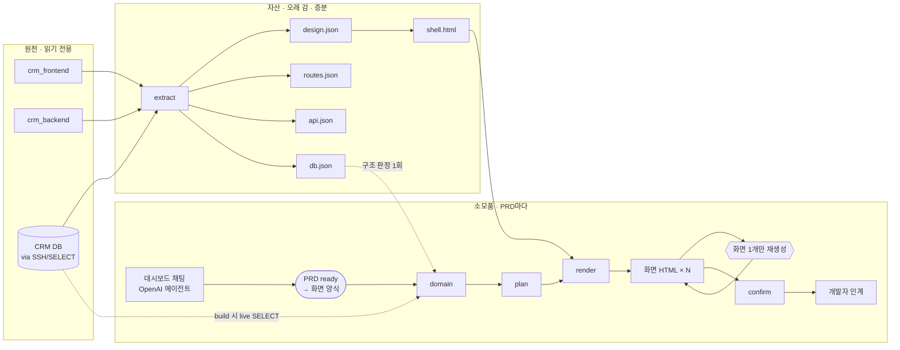

# Wireframe

**목적:** 비개발자가 본인 지식 + PRD로 와이어프레임을 만들고, 개발자는 **확정된 화면**을
받아 구현 시간을 줄인다.

비개발자가 자연어 PRD만 넣으면, 기존 CRM 프론트·백·DB·디자인 자산 위에서 화면 HTML이
나온다. 마음에 들 때까지 화면 단위로 고친 뒤 개발자에게 넘긴다.

로컬이 1차 목표다. 파이프라인 본진은 **이 레포**. PRD 확정·보완은 대시보드 OpenAI 에이전트
(`OPENAI_API_KEY`). 라이브 DB는 `.env`의 SSH/DB만.

팀은 루트 도메인(로컬이면 `http://localhost:5173`)에서 본다.

## 왜

화면 디자이너가 없다. 요청이 이메일로 들어오고, 화면 없이 개발이 시작되니
UX가 어긋난다. 요청자가 **먼저 화면을 보고 고쳐서** 넘기면 그게 사라진다.

## 제품 흐름

```
① PRD 입력 → 모호한 부분 확정 → 사용자 승인(ready)
   → (승인 후) 화면 양식만 확정 → PRD 탭 저장
② projects/{slug} 자산 + 승인 PRD + live DB → 와이어프레임 1차 생성
③ 멀티턴으로 다듬기 → 사용자 승인(confirmed) → 와이어프레임 완료
```

| 단계 | 탭 | 상태 |
| --- | --- | --- |
| ① | `/prd` | OpenAI 확정·보완 (`prd review` / `prd answer`) |
| ②③ | `/wireframes` | 목록 → **플로우 버튼으로 HTML 1장씩** 보기 · CLI `run build` / `render` |
| 자산 | `/assets` | JSON 뷰어 |
| DB | `/db` | SELECT 전용 조회 채팅 (`.env`만) |

로컬:

1. `.env` — `OPENAI_API_KEY`, `SSH_*` / `DB_*` (DB는 env만, SELECT 권장)
2. `npm run dev` → http://localhost:5173/prd

```bash
cp .env.example .env   # OPENAI_API_KEY=sk-...
npm install
npm run build --prefix packages/cli
npm run dev
```

## 파이프라인 (전체)

요청자가 만지는 md는 **PRD(`wireFrame/runs/{run}/input/v*.md`)뿐**이다.



자세한 구현안: [PIPELINE.md](./PIPELINE.md) · [AGENTS.md](./AGENTS.md) · [SPEC.md](./SPEC.md)

## 핵심

**자산과 소모품을 나눈다.** `projects/{slug}/`는 오래 가고, 화면 HTML은 소모품이다.

**생성 단위는 산출물 1개다.** 잠금(`locked`)된 화면은 유지한다.

**한 화면 = 한 플로우 단계 HTML.** 대시보드 사이드바·앱 크롬 없이, 상단 플로우
버튼만으로 전환한다. HTML에는 설명 문구 없이 **UI·동작만**.

**화면 양식은 PRD 승인(ready) 뒤에만 묻는다** (`phase=layout`).  
전체 페이지 / 팝업·모달 / 목록 표 / 단계별(`uiPattern`). HTML은 가운데·비율 맞춤.

**DB 질의는 반복 루프 밖이다.** 추출·구조 판정·`run build` 1회만 live SELECT.
재생성(`render`)은 `domain.json` 재사용.

## 문서

| | |
| --- | --- |
| [PIPELINE.md](./PIPELINE.md) | 로컬 구현 파이프라인 |
| [AGENTS.md](./AGENTS.md) | 에이전트 계약 |
| [WORKFLOW.md](./WORKFLOW.md) | 사람 흐름 |
| [SPEC.md](./SPEC.md) | 파일 스펙 |

## 폴더

```
server/                   OpenAI·DB API (Vite /api/*)
packages/cli/             wireframe CLI (SSOT)
projects/{slug}/          자산 (json + design.md + shell.html)
wireFrame/                PRD · clarifications · domain · manifest · HTML
src/                      대시보드 UI
```

## 뷰어

```bash
npm run dev      # /prd         PRD 확정·보완
                 # /wireframes  목록 → 플로우별 HTML 1장 (스크롤 없이 맞춤)
                 # /db          live DB 조회
                 # /assets      JSON 자산
```

CLI:

```bash
wireframe prd review|answer --run-id …
wireframe run build --run-id … --project crm
wireframe render --run-id … [--artifact id] [--instruction "…"]
wireframe run confirm --run-id …
```
