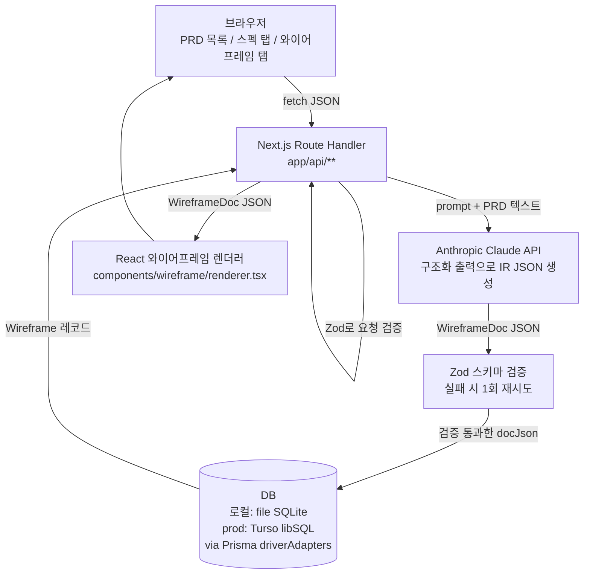
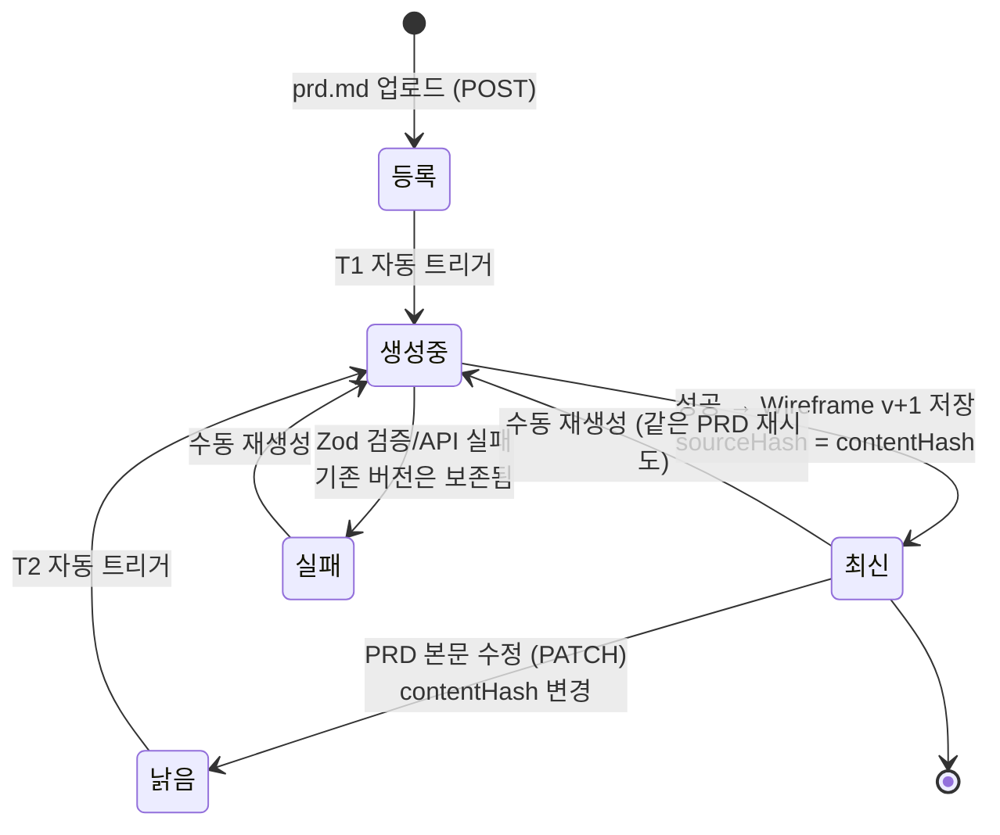

# 기술 스펙: 스펙 기반 와이어프레임 생성 대시보드

| 항목 | 내용 |
|---|---|
| 문서 상태 | **Draft** |
| 작성일 | 2026-08-28 |
| 작성 주체 | AX팀 |
| 대상 독자 | AX팀 개발 담당자 |

---

## 1. 개요

### 1.1 목적

- 회사에 화면 디자이너가 없다. PRD/스펙 텍스트만 존재하는 상태에서 화면 논의가 말로만 진행되어, 이해관계자 간 화면 인식이 어긋나는 문제가 반복된다.
- PRD 텍스트를 붙여넣으면 **와이어프레임 수준**의 화면을 자동 생성해 주는 내부 대시보드를 만든다.
- 목표 품질은 "와이어프레임". 고품질 UI 디자인, 브랜드 스타일 적용, 픽셀 단위 완성도는 목표가 아니다.

### 1.2 해결하려는 문제

- PRD만 보고 화면 구조를 각자 다르게 상상하는 커뮤니케이션 비용.
- 기획 초기 단계에서 화면 시안을 만들 리소스(디자이너) 부재.
- 스펙 변경 시 화면 논의 산출물이 빠르게 낡아버리는 문제 → 재생성으로 대응.

### 1.3 기능 범위

기능 범위는 **"스펙 기반 와이어프레임 생성" 하나로 한정**한다.

- **`prd.md` 파일 업로드** 또는 텍스트 붙여넣기로 PRD 등록 (핵심 입력 경로는 파일 업로드: prd.md를 넣으면 와이어프레임이 나온다)
- PRD 등록/수정/삭제 (CRUD)
- PRD로부터 와이어프레임 **자동 생성** (LLM) — 등록·원문 수정 시 자동 트리거된다. **PRD가 단일 진실 공급원(SSOT)이고 와이어프레임은 순수 파생물**이다: prd.md 내용이 바뀌면 와이어프레임도 바뀐다 (§6)
- **인터랙티브 와이어프레임**: 정적 그림이 아니라 클릭 동작이 작동한다 — 버튼/메뉴 클릭 시 화면 전환, 모달 열기/닫기, 탭 전환 (프로토타입 수준의 목업 인터랙션)
- 스펙 탭 / 와이어프레임 탭으로 전환하며 확인
- 재생성 및 생성 이력(버전) 조회

**대상 화면의 성격**: 생성 대상은 전부 도메인 데이터를 보여주는 정보성 페이지로, **관리자(어드민) 페이지처럼 운영**된다. 따라서 IR·프롬프트·렌더러 모두 어드민 패턴(사이드바 내비게이션, 목록 테이블 + 검색/필터, 상세/편집 폼, 모달)을 1급으로 지원하도록 설계한다 (§5, §11).

### 1.4 Non-Goals (명시적으로 안 하는 것)

| 항목 | 사유 |
|---|---|
| 픽셀 퍼펙트 / 하이파이 디자인 | 목표 품질이 와이어프레임. 디자인 완성도는 범위 밖 |
| 디자인 시스템 토큰 관리 | 내부 도구 1개 화면 스타일이면 충분 |
| 실제 데이터 연동·비즈니스 로직 실행 | 인터랙션은 화면 전환/모달/탭 등 **목업 수준**까지만. 실제 API 호출, 실데이터 CRUD, 검증 로직 실행은 범위 밖 |
| 협업 기능 (코멘트, 멘션, 공유 권한) | 초기 사용자 = AX팀 소수. URL 공유로 대체 |
| **와이어프레임 수동 편집 (에디터 UI)** | **결정됨.** PRD가 단일 진실 공급원(SSOT)이고 와이어프레임은 파생물이다. 화면을 바꾸려면 PRD를 바꾼다. 편집본과 재생성본이 갈라지는 상태를 아예 만들지 않는다 (§6) |
| 인증·권한 | **결정됨 — 추후 도입.** 초기 제외, 비공개 URL로 운용. 도입 시점·방식은 §15.1 |
| 실시간 동기화 (멀티유저 동시 편집) | 단일 작성자 시나리오만 지원. 위 "수동 편집 없음"과 맞물려 동시 편집 충돌 자체가 발생하지 않는다 |
| **이미지 / Figma export** | **결정됨 — 불필요.** 공유는 URL로 충분 |
| 와이어프레임 → 프로덕션 코드 export | 범위 밖 |
| Anthropic 외 멀티 LLM 지원 | 초기엔 Claude API 단일 |

---

## 2. 사용자 시나리오

주 사용자: AX팀 담당자 (기획/개발 겸임).

1. 대시보드 접속 → PRD 목록 화면.
2. "새 PRD" 클릭 → **`prd.md` 파일을 드래그&드롭(또는 파일 선택)** 으로 업로드. 파일명이 제목 기본값이 되고, 파일 내용이 `sourceText`로 저장된다. (파일 없이 텍스트 붙여넣기도 가능 — 보조 경로)
3. **등록 즉시 와이어프레임 생성이 자동으로 시작된다** (§6 트리거 T1). 별도 "생성" 버튼을 누를 필요가 없다. PRD 상세(`/prd/[id]/spec`)로 이동하면 진행 상태가 표시된다 (수 초~수십 초).
4. **스펙 탭**에서 업로드된 원문(Markdown) 확인.
5. 생성 완료 → **와이어프레임 탭**(`/prd/[id]/wireframe`)으로 전환하여 결과 확인.
6. **인터랙션 확인**: 렌더된 와이어프레임 안에서 사이드바 메뉴/버튼을 실제로 클릭해 본다 — "상세 보기" 클릭 → 상세 화면으로 전환, "삭제" 클릭 → 확인 모달 열림 등. 어드민 운영 플로우가 화면 사이에서 이어지는지 검증한다.
7. 결과가 어긋나면 스펙 탭으로 돌아가 PRD 텍스트를 수정(또는 수정된 prd.md 재업로드) → **저장하면 자동으로 재생성된다** (§6 트리거 T2). 화면을 바꾸는 방법은 PRD를 바꾸는 것뿐이다 — 와이어프레임을 직접 편집하는 경로는 없다 (§1.4, §6.1).
8. PRD는 그대로인데 결과만 다시 뽑고 싶거나 자동 생성이 실패했으면 **수동 "재생성" 버튼**을 쓴다 (§6.2).
9. 재생성 결과는 새 버전으로 쌓이고, 이전 버전도 선택해서 볼 수 있다.
10. 팀원에게 URL(`/prd/[id]/wireframe`)을 공유. 받은 사람은 새로고침만으로 같은 화면을 보고, 같은 인터랙션을 클릭해 볼 수 있다.

---

## 3. 기술 스택

| 레이어 | 선택 | 선택 이유 |
|---|---|---|
| 프론트엔드 | **Next.js 15 (App Router)** | Vercel 배포가 하드 요구사항. Vercel은 Next.js 제작사라 배포·라우팅·서버 함수 연동이 zero-config에 가깝다. App Router의 layout 중첩이 탭 셸 구조(§9)와 정확히 맞는다 |
| 언어 | **TypeScript** | 와이어프레임 IR(§5)이 discriminated union 기반 → 타입 시스템 없이는 렌더러/검증 유지가 어렵다 |
| 스타일 | **Tailwind CSS** | 와이어프레임 렌더러는 회색조 박스 위주. 컴포넌트별 CSS 파일 관리 없이 유틸리티로 충분 |
| 백엔드 | **Next.js Route Handlers** | 별도 백엔드 서버(Express, FastAPI 등)를 두면 배포 대상이 2개가 되고 Vercel 장점이 사라진다. Route Handler는 같은 저장소·같은 배포 단위·같은 타입 공유(IR 타입을 프론트/백이 그대로 import) → Next.js와 연동이 가장 좋은 선택 |
| ORM | **Prisma** | 스키마 선언 → 타입 자동 생성으로 TS와 결합. `driverAdapters`로 로컬 SQLite와 프로덕션 Turso를 같은 스키마로 커버(§3.1, §7) |
| DB (로컬) | **SQLite (file)** | 요구사항. 개발 환경 셋업 zero-dependency |
| DB (프로덕션) | **Turso (libSQL)** | SQLite 호환 서버리스 DB. Vercel 서버리스에서 file SQLite가 영속되지 않는 문제(아래 경고)의 해결책. §3.1 비교표 참고 |
| 생성 엔진 | **Anthropic Claude API** | 구조화 출력(JSON Schema 강제)을 지원해 IR 생성에 적합. 모델 전략은 §11 |
| 검증 | **Zod** | LLM 응답(IR JSON)의 런타임 검증 + API 요청 바디 검증. `z.infer`로 TS 타입과 단일 소스 유지 |
| 배포 | **Vercel** | 요구사항 |

### 3.1 ⚠️ 기술 리스크: Vercel 서버리스에서 file SQLite는 영속되지 않는다

**이 프로젝트에서 가장 먼저 인지해야 할 제약이다.**

- Vercel의 서버 코드는 서버리스 함수로 실행된다. 함수의 파일시스템은 **배포 산출물 기준 읽기 전용에 가깝고, 인스턴스가 수시로 생성/폐기**된다.
- `DATABASE_URL="file:./dev.db"` 같은 파일 기반 SQLite를 쓰면:
  - 배포할 때마다 DB 파일이 초기화된다 (배포 산출물에 포함된 상태로 리셋).
  - 런타임에 쓰기가 되더라도 해당 함수 인스턴스의 임시 스토리지에만 남고, 다른 인스턴스/다음 요청에서는 보이지 않으며 곧 사라진다.
- 즉 **로컬에서 잘 되던 file SQLite가 Vercel에선 "저장이 안 되는" 앱이 된다.** 이는 버그가 아니라 플랫폼 특성이다.

**해결 구조: "SQLite 문법·스키마는 그대로, 커넥션만 교체"**

- 로컬 개발: Prisma + `file:./dev.db` (기존 SQLite 그대로)
- 프로덕션(Vercel): **Turso (libSQL)** — SQLite 호환 프로토콜의 서버리스 호스팅 DB. Prisma `driverAdapters` preview + `@prisma/adapter-libsql`로 연결.
- Prisma 스키마의 `provider = "sqlite"`는 양쪽에서 동일하다. 마이그레이션 SQL도 SQLite 문법 그대로 Turso에 적용된다. 바뀌는 것은 런타임 커넥션(어댑터)과 환경 변수뿐.
- 결과적으로 **요구사항 1(SQLite)과 요구사항 2(Vercel 배포)를 동시에 만족**한다.

```ts
// lib/db.ts — 환경에 따라 커넥션만 교체
import { PrismaClient } from "@prisma/client";
import { PrismaLibSQL } from "@prisma/adapter-libsql";

function createClient() {
  if (process.env.TURSO_DATABASE_URL) {
    // 프로덕션(Vercel): Turso
    const adapter = new PrismaLibSQL({
      url: process.env.TURSO_DATABASE_URL,
      authToken: process.env.TURSO_AUTH_TOKEN,
    });
    return new PrismaClient({ adapter });
  }
  // 로컬: file SQLite
  return new PrismaClient();
}

export const db = createClient();
```

**대안 비교 (결론: Turso 권장안 확정)**

| 대안 | SQLite 요구 충족 | 스키마/코드 변경 | 무료 티어 | 비고 |
|---|---|---|---|---|
| **Turso (libSQL)** ✅ 권장 | O (SQLite 호환) | 없음 (어댑터만) | 넉넉함 (내부 도구 규모엔 충분) | SQLite 문법 유지가 최대 장점 |
| Vercel Postgres (Neon) | X (Postgres) | provider 변경 + 마이그레이션 재작성 | 있음 | Vercel 통합은 편하지만 "DB는 SQLite" 요구 위반 |
| Cloudflare D1 | O (SQLite 기반) | Vercel에서 접근 구조가 부자연스러움 | 있음 | Cloudflare Workers 전제 설계. Vercel 배포와 궁합 나쁨 |
| file SQLite + Vercel | O | 없음 | - | **동작 불가** (위 경고). 선택지 아님 |

---

## 4. 아키텍처

단일 Next.js 앱. 별도 백엔드/워커 없음.



요청 흐름 요약:

1. 생성이 트리거된다 — PRD 등록(`POST /api/prds`, T1)·원문 수정(`PATCH`, T2) 시 **자동**, 또는 수동 재생성 버튼(`POST /api/prds/[id]/generate`) (§6). 어느 경로든 `GenerationJob` 생성(PENDING).
2. Route Handler가 PRD 원문을 프롬프트에 넣어 Claude API 호출 (구조화 출력).
3. 응답 JSON을 Zod로 검증. 실패 시 에러 내용을 포함해 1회 재시도(§11).
4. 검증 통과한 IR을 `Wireframe` 레코드(docJson, 버전 +1)로 저장, Job을 DONE으로.
5. 와이어프레임 탭이 최신 `Wireframe`을 조회 → React 렌더러가 IR을 그리고, 인터랙션 런타임(§5.4)이 클릭 동작(화면 전환/모달)을 실행한다.

**LLM이 HTML을 만들지 않는다**는 점이 이 아키텍처의 핵심이다(§5).

---

## 5. 와이어프레임 생성 방식 (핵심 설계 결정)

### 5.1 결정: LLM은 구조화된 JSON IR을 생성하고, 렌더링은 React가 한다

LLM이 HTML/JSX를 통째로 뱉게 하는 방식은 **채택하지 않는다**. 대신:

- LLM 출력 = **와이어프레임 IR(중간 표현)** — 아래 `WireframeDoc` JSON.
- 렌더링 = 프론트의 **React 렌더러**가 IR을 순회하며 미리 정의된 컴포넌트로 그린다.

**왜 IR인가 (HTML 직접 생성 대비):**

| 근거 | 설명 |
|---|---|
| 검증 가능 | JSON은 Zod 스키마로 기계 검증이 된다. "화면이 깨졌는지"를 저장 전에 판정 가능. HTML은 유효성 판정 기준 자체가 모호 |
| 부분 수정 가능 | 노드/화면 단위 구조라 특정 화면만 따로 생성·교체하는 확장이 열려 있다. 화면 수가 많은 PRD의 분할 생성(§15.2)이 필요해질 때 이 성질이 쓰인다. HTML 덩어리는 diff/부분 생성이 사실상 불가. (사용자가 손으로 노드를 편집하는 기능은 만들지 않는다 — §6.1) |
| 렌더링 일관성 | 같은 `type`은 항상 같은 컴포넌트로 그려진다. 생성할 때마다 화면 스타일이 널뛰는 문제 차단. 와이어프레임 톤(회색조 박스)도 렌더러가 강제 |
| 보안 | LLM 산출물을 `dangerouslySetInnerHTML`로 주입하지 않는다. IR은 데이터일 뿐이고 렌더러가 그리므로 script 주입 경로가 없다 |
| 인터랙션도 데이터로 | 동작(화면 이동, 모달 열기)을 `Action` union 데이터로 표현하고 렌더러가 실행한다(§5.4). LLM이 HTML+JS를 생성하는 방식이면 임의 스크립트를 실행해야 해서 인터랙션 요구와 보안이 충돌하지만, Action은 렌더러에 화이트리스트된 동작만 수행한다 |
| 저장/버전 효율 | JSON 문자열 1개 컬럼(`docJson`)으로 버전 관리가 단순해진다 |

트레이드오프: 표현력은 렌더러가 지원하는 노드 타입으로 제한된다. → 와이어프레임 수준이 목표이므로 의도된 제약이다. 타입 부족이 확인되면 IR `version`을 올려 확장한다.

### 5.2 IR 타입 정의

`lib/wireframe/types.ts` (Zod 스키마는 이 타입과 1:1로 `lib/wireframe/schema.ts`에 정의하고, `z.infer`로 타입을 도출해 단일 소스를 유지한다):

```ts
/** 최상위 문서. docJson 컬럼에 이 객체가 직렬화되어 저장된다. */
export interface WireframeDoc {
  /** IR 스키마 버전. 렌더러 호환성 판단용. 현재 "1" */
  version: string;
  screens: Screen[];
}

export interface Screen {
  id: string;            // 문서 내 유일. 예: "scr-login"
  name: string;          // 사람이 읽는 이름. 예: "로그인"
  route: string;         // 이 화면의 가상 라우트. 예: "/login"
  layout: "single" | "sidebar-left" | "sidebar-right" | "header-content";
  nodes: Node[];         // 12컬럼 그리드에 배치되는 최상위 노드들
}

/** 클릭 시 수행되는 목업 인터랙션. 렌더러가 화이트리스트로 실행한다 (§5.4) */
export type Action =
  | { type: "navigate"; targetScreenId: string }   // 다른 Screen으로 전환
  | { type: "openModal"; targetNodeId: string }    // 해당 화면의 modal 노드 열기
  | { type: "closeModal" }                         // 열린 모달 닫기 (modal 내부 버튼용)
  | { type: "none" };                              // 클릭 가능해 보이지만 동작 없음(명시적)

/** nav/sidebar 항목 — 항목별로 이동 대상을 가진다 */
export interface NavItem {
  label: string;
  action?: Action;       // 보통 navigate. 생략 시 동작 없음
}

/** 모든 노드의 공통 필드 */
interface BaseNode {
  id: string;            // 문서 내 유일. 부분 수정의 참조 키
  gridSpan?: number;     // 1~12. 생략 시 12 (전체 폭)
}

/** discriminated union — `type`으로 분기 */
export type Node =
  | HeaderNode | NavNode | SidebarNode
  | TextNode | HeadingNode
  | ButtonNode | InputNode | SelectNode | CheckboxNode
  | TableNode | ListNode | CardNode | ImageNode
  | TabsNode | ModalNode | DividerNode | ContainerNode;

export interface HeaderNode extends BaseNode {
  type: "header";
  props: { title: string; actions?: string[] };   // actions: 우측 버튼 라벨들
}

export interface NavNode extends BaseNode {
  type: "nav";
  props: { items: NavItem[]; activeIndex?: number };
}

export interface SidebarNode extends BaseNode {
  type: "sidebar";
  props: { items: NavItem[]; activeIndex?: number };  // 어드민 좌측 메뉴. 항목 action=navigate로 화면 전환
  children?: Node[];
}

export interface TextNode extends BaseNode {
  type: "text";
  props: { content: string; muted?: boolean };
}

export interface HeadingNode extends BaseNode {
  type: "heading";
  props: { content: string; level: 1 | 2 | 3 };
}

export interface ButtonNode extends BaseNode {
  type: "button";
  props: { label: string; variant: "primary" | "secondary" | "danger" };
  action?: Action;       // 클릭 동작. 예: "상세" 버튼 → navigate, "삭제" → openModal(확인 모달)
}

export interface InputNode extends BaseNode {
  type: "input";
  props: { label: string; placeholder?: string; inputType?: "text" | "password" | "email" | "number" | "textarea" };
}

export interface SelectNode extends BaseNode {
  type: "select";
  props: { label: string; options: string[] };
}

export interface CheckboxNode extends BaseNode {
  type: "checkbox";
  props: { label: string; checked?: boolean };
}

export interface TableNode extends BaseNode {
  type: "table";
  props: { columns: string[]; sampleRows?: string[][]; rowCount?: number };
  rowAction?: Action;    // 행 클릭 동작. 어드민 "목록 → 상세" 전환의 핵심 (보통 navigate)
}

export interface ListNode extends BaseNode {
  type: "list";
  props: { items: string[]; ordered?: boolean };
}

export interface CardNode extends BaseNode {
  type: "card";
  props: { title?: string };
  children: Node[];
}

export interface ImageNode extends BaseNode {
  type: "image";
  props: { alt: string; aspectRatio?: "16:9" | "4:3" | "1:1" };  // 실제 이미지 없음. 회색 placeholder 박스
}

export interface TabsNode extends BaseNode {
  type: "tabs";
  props: { labels: string[]; activeIndex?: number };
  children?: Node[];     // 활성 탭의 내용만 표현
}

export interface ModalNode extends BaseNode {
  type: "modal";
  props: { title: string; open?: boolean };  // open=false면 렌더러가 접힌 표시로 그림
  children: Node[];
}

export interface DividerNode extends BaseNode {
  type: "divider";
  props: Record<string, never>;
}

export interface ContainerNode extends BaseNode {
  type: "container";
  props: { direction: "row" | "column"; gap?: "sm" | "md" | "lg" };
  children: Node[];
}
```

### 5.3 12컬럼 그리드 배치 규칙

- `Screen.nodes`의 각 최상위 노드는 12컬럼 그리드에 배치된다. `gridSpan`(1~12, 기본 12)이 폭을 결정한다.
- 렌더러는 노드를 문서 순서대로 채우고, 한 행의 span 합이 12를 넘으면 자동 줄바꿈한다 (CSS Grid `grid-cols-12` + `col-span-N`으로 자연 구현).
- `children` 내부 배치는 부모가 결정한다: `container`는 `direction`으로 flex 배치, `card`/`modal`은 세로 스택. 중첩 노드의 `gridSpan`은 `container(direction: "row")` 내부에서만 의미를 가진다.
- LLM에게는 "나란히 배치할 요소는 gridSpan 합이 12가 되도록" 지시한다 (예: 폼 2열 = 6+6, 사이드 정보 = 8+4).
- 검증 규칙(Zod refine): `gridSpan`은 1~12 정수. 합계 강제는 하지 않는다(넘치면 줄바꿈이라 깨지지 않음).

### 5.4 인터랙션 런타임 (동작이 작동하는 와이어프레임)

와이어프레임은 정적 그림이 아니라 **클릭하면 동작하는 프로토타입**이다. 단, 동작의 실행 주체는 LLM 산출물이 아니라 렌더러다.

- 렌더러(`renderer.tsx`)는 클라이언트 컴포넌트로, 다음 로컬 상태를 가진 경량 상태 머신이다:

```ts
interface ViewerState {
  currentScreenId: string;      // 현재 표시 중인 Screen (초기값: screens[0].id)
  openModalId: string | null;   // 열려 있는 modal 노드 id
  history: string[];            // navigate 스택 → "뒤로" 버튼 제공
}
```

- 클릭 가능한 노드(button, nav/sidebar 항목, table 행)는 부착된 `Action`을 단일 `dispatch(action)` 함수로 실행한다:
  - `navigate` → `currentScreenId` 교체 (+history push). 화면 간 전환이 와이어프레임 안에서 일어난다.
  - `openModal` / `closeModal` → `openModalId` 토글. `modal` 노드는 `openModalId`와 일치할 때만 오버레이로 렌더.
  - `tabs` 노드의 탭 클릭은 Action 없이 렌더러가 자체 처리한다 (`activeIndex` 로컬 상태) — 탭 전환은 항상 공짜로 동작.
  - `input`/`select`/`checkbox`는 실제 타이핑·선택이 되는 controlled 컴포넌트로 렌더한다. 값은 뷰어 로컬 상태일 뿐 저장·검증되지 않는다 (목업 수준, §1.4 Non-Goals).
- 이 상태는 **뷰어 세션 한정**이다. 새로고침하면 초기 화면으로 돌아간다. 상태 저장/공유는 범위 밖.
- 실행 가능한 동작은 `Action` union에 정의된 것뿐이다. LLM이 임의 코드를 실행시킬 경로가 없다.
- 검증 규칙(Zod refine, 저장 전):
  - `navigate.targetScreenId`는 `doc.screens[].id` 중 하나여야 한다 (깨진 링크 차단).
  - `openModal.targetNodeId`는 해당 화면에 존재하는 `modal` 노드 id여야 한다.
  - 위반 시 §11.3 재시도 플로우로 LLM에 오류를 돌려보낸다.

---

## 6. 생성 트리거 정책 (PRD → 와이어프레임 단방향 파생)

### 6.1 원칙: PRD가 단일 진실 공급원(SSOT)

- **PRD가 유일한 입력이고, 와이어프레임은 그로부터 계산된 파생물(derived artifact)이다.**
- 데이터 흐름은 **단방향**이다. PRD → 와이어프레임. 역방향은 없다.
- 따라서 **와이어프레임은 어떤 경로로도 직접 편집하지 않는다.** 화면을 바꾸고 싶으면 `prd.md`를 바꾼다.
- 혼동 주의: 편집이 금지되는 대상은 **와이어프레임**이지 PRD가 아니다. PRD 원문 편집과 `prd.md` 재업로드는 계속 지원한다 (§2 시나리오).

**왜 자동 재생성이 필요한가**: PRD는 한 번 쓰고 끝나는 문서가 아니다. 화면을 보고 나면 **추가 수정·신규 요청사항이 계속 붙는다.** 즉 이 도구의 주 사용 패턴은 "한 번 생성"이 아니라 **"PRD 수정 → 화면 확인 → 또 수정"의 반복 루프**다. 이 루프가 도구의 값어치이므로, PRD 변경이 화면에 반영되는 경로에 수동 단계(버튼 클릭)를 끼워 넣지 않는다. 이 전제는 아래 §6.5(재생성 안정성)의 근거이기도 하다 — 루프가 주 패턴이라면 재생성의 **품질**만큼 **변경의 국소성**이 중요해진다.

**왜 이 모델인가**

| 근거 | 설명 |
|---|---|
| 분기(divergence) 문제 소멸 | 수동 편집을 허용하면 "편집된 화면"과 "재생성된 화면"이 갈라지고, 재생성 시 사용자 편집을 보존할지 버릴지를 매번 판정해야 한다. 사실상 merge 문제이며 내부 도구가 감당할 복잡도가 아니다. 단방향이면 이 문제가 발생하지 않는다 |
| 화면의 근거가 항상 문서에 남음 | 이 도구의 목적은 예쁜 그림이 아니라 "PRD에 대한 화면 인식을 맞추는 것"(§1.2)이다. 화면이 PRD에서만 나오면, 화면에 대한 이견은 항상 PRD 문장으로 환원되어 논의가 수렴한다. 화면만 몰래 고칠 수 있으면 이 성질이 깨진다 |
| 공수 절감 | 노드 편집 에디터 UI(선택·드래그·속성 패널·undo)는 별도 프로젝트급 공수다. 디자이너 부재를 메우려는 도구가 디자인 툴을 만드는 일로 번지지 않게 한다 |

**트레이드오프**: 버튼 라벨 한 줄을 고치려 해도 PRD를 고쳐야 한다. 이는 의도된 제약이다 — 오히려 PRD를 최신 상태로 유지시키는 압력으로 작동하며, 스펙과 화면이 어긋나는 §1.2의 문제를 구조적으로 막는다.

### 6.2 자동 트리거

사용자는 "생성" 버튼을 누르는 단계를 거치지 않는다. **등록하면 곧 화면이 만들어진다.**

| # | 트리거 | 동작 |
|---|---|---|
| **T1** | `POST /api/prds` 성공 (= `prd.md` 등록) | 즉시 생성 Job 시작. **등록 = 생성** |
| **T2** | `PATCH /api/prds/[id]`로 `sourceText`가 실제 변경됨 | 즉시 재생성 Job 시작. 같은 PRD에 수정된 `prd.md`를 재업로드하는 경로도 여기에 해당 |

- **`title`만 바뀐 경우는 재생성하지 않는다.** 화면 산출물과 무관한 변경에 토큰을 쓰지 않기 위해서다. "실제 변경" 판정은 §6.3의 해시 비교로 한다.
- 이미 `PENDING`/`RUNNING` Job이 있는 PRD에 트리거가 겹치면 새 Job을 만들지 않고 기존 Job을 반환한다 (중복 생성·중복 과금 방지, §8.1 `GENERATION_IN_PROGRESS`).

**수동 "재생성" 버튼은 유지한다.** 자동 트리거만 두면 다음 두 경우가 막히기 때문이다:

1. PRD는 그대로인데 생성 결과가 마음에 들지 않아 다시 뽑고 싶을 때 (LLM 출력은 비결정적이다).
2. 자동 생성이 `FAILED`로 끝났을 때의 복구 경로.

### 6.3 stale(낡음) 판정

자동 트리거가 있어도 **화면에 보이는 와이어프레임이 현재 PRD와 불일치하는 구간이 존재한다** — 재생성이 진행 중이거나(수십 초), 실패했거나, 트리거가 유실된 경우다. 이 구간을 사용자에게 숨기면 낡은 화면을 최신으로 오해하게 된다.

- `Prd.contentHash` = 현재 원문의 `sha256(sourceText)`
- `Wireframe.sourceHash` = **그 와이어프레임을 생성할 때 쓴** 원문의 해시
- 두 값이 다르면 그 와이어프레임은 **stale**이다.

stale일 때 와이어프레임 탭 상단에 경고 배너와 재생성 버튼을 띄운다 (§10.3).

**왜 해시 컬럼인가**: `sourceText` 전체 문자열 비교는 매 조회마다 원문을 끌고 와야 해서 비싸고, `updatedAt`은 `title`만 바꿔도 갱신되므로 "본문이 바뀌었는가"를 판정할 수 없다. 고정 길이 해시 비교가 두 문제를 동시에 해결한다.

### 6.4 상태 전이



- `실패` 상태에서도 **직전 성공 버전은 계속 조회·클릭 가능**하다. 생성 실패가 기존 산출물을 훼손하지 않는 것은 `Wireframe`을 버전 테이블로 분리한 이유이기도 하다 (§7).
- `낡음`은 별도 DB 컬럼이 아니라 해시 비교로 **조회 시점에 계산되는 파생 상태**다. 상태 컬럼을 늘리면 트리거 실패 시 실제 데이터와 어긋난 채로 남기 때문이다.

---

### 6.5 재생성 안정성 (변경의 국소성)

**문제**: 반복 루프(§6.1)가 주 사용 패턴이라면, PRD에 요구사항 한 줄을 추가했을 때 **와이어프레임이 그 부분만 바뀌어야** 한다. 그런데 LLM 출력은 비결정적이라, 같은 PRD를 두 번 넣어도 화면 분해·화면 이름·노드 id·레이아웃이 통째로 달라질 수 있다. 그러면 사용자는 매 재생성마다 화면 전체를 다시 읽고 "내가 추가한 게 어디에 반영됐지?"를 찾아야 한다. **추가 요청을 반영하려고 만든 루프가 오히려 확인 비용을 늘리는 역전이 일어난다.**

**대응: 자동 재생성(T2)은 이전 IR을 앵커로 넘긴다.**

| 트리거 | 이전 IR 전달 | 의도 |
|---|---|---|
| **T1** (최초 등록) | 없음 | 기준이 없다 |
| **T2** (PRD 본문 수정) | **직전 성공 버전의 IR을 프롬프트에 함께 전달** | "변경된 PRD에 맞춰 **필요한 부분만** 고치고, 나머지 `screens[].id`·노드 `id`·구조는 유지하라"고 지시 (§11.1) |
| **수동 재생성** | 없음 | 결과가 마음에 들지 않아 다시 뽑는 경우다. 오히려 **다른 구조**를 원하는 상황이므로 앵커를 걸지 않는다 |

이 매핑은 수동 버튼의 존재 이유도 분명하게 만든다 — **"PRD 변경 반영"은 T2가, "구조를 새로 뽑기"는 수동 버튼이** 담당한다.

**id 안정성이 주는 부수 효과**

- 재생성 후에도 사용자가 **보고 있던 화면에 그대로 머무를 수 있다** (§10.3). id가 매번 바뀌면 재생성할 때마다 첫 화면으로 튕긴다 — 루프를 도는 사용자에게 가장 거슬리는 지점이다.
- 버전 간 비교(무엇이 바뀌었는지)가 id 기준으로 계산 가능해진다. 다만 diff **뷰**를 만들지는 미결이다 (§15.2).

**한계 (인지하고 넘어감)**: 앵커는 지시일 뿐 보장이 아니다. LLM이 id를 갈아버릴 수 있고, PRD를 대폭 뜯어고친 경우엔 오히려 낡은 구조에 갇힐 수도 있다. v1은 "대체로 안정적이면 성공"으로 두고, 실제 루프를 돌려 본 뒤(Phase 4) 앵커 프롬프트를 조정한다. id 유지를 기계적으로 강제하는 방법(이전 id 목록을 스키마 enum으로 제약 등)은 과설계로 판단해 v1에서 제외한다.

---

## 7. 데이터 모델

`prisma/schema.prisma`:

```prisma
generator client {
  provider        = "prisma-client-js"
  previewFeatures = ["driverAdapters"]   // Turso(libSQL) 어댑터용
}

datasource db {
  provider = "sqlite"                    // 로컬 file / prod Turso 모두 이 스키마
  url      = env("DATABASE_URL")
}

model Prd {
  id         String          @id @default(cuid())
  title      String
  sourceText String                       // PRD 원문 텍스트 (업로드된 prd.md의 내용)
  contentHash String                      // sha256(sourceText). 변경 감지·stale 판정용 (§6.3)
  status     String          @default("DRAFT")   // "DRAFT" | "GENERATING" | "GENERATED" | "FAILED" — 앱단 유니온
  createdAt  DateTime        @default(now())
  updatedAt  DateTime        @updatedAt

  wireframes Wireframe[]
  jobs       GenerationJob[]
}

model Wireframe {
  id        String   @id @default(cuid())
  prdId     String
  prd       Prd      @relation(fields: [prdId], references: [id], onDelete: Cascade)
  version   Int                            // PRD 내에서 1부터 증가
  docJson   String                         // WireframeDoc 직렬화(JSON 문자열)
  sourceHash String                        // 이 와이어프레임을 만들 때 쓴 PRD 원문의 해시 (§6.3)
  model     String                         // 생성에 사용한 모델 ID. 예: "claude-sonnet-5"
  createdAt DateTime @default(now())

  @@unique([prdId, version])              // 같은 PRD에 같은 버전 중복 금지
  @@index([prdId, createdAt])             // "이 PRD의 최신 와이어프레임" 조회용
}

model GenerationJob {
  id        String   @id @default(cuid())
  prdId     String
  prd       Prd      @relation(fields: [prdId], references: [id], onDelete: Cascade)
  status    String   @default("PENDING")   // "PENDING" | "RUNNING" | "DONE" | "FAILED" — 앱단 유니온
  error     String?                        // FAILED일 때 원인 메시지
  createdAt DateTime @default(now())

  @@index([prdId, status])                // 진행 중 Job 폴링 조회용
}
```

설계 노트:

- **id는 `cuid()` 문자열 PK.** 화면이 PRD 단위로 관리되고 URL(`/prd/[id]`)에 그대로 노출되므로, 추측 불가능하고 정렬 충돌 없는 cuid를 쓴다. auto-increment 정수는 URL에서 전체 개수가 노출되고 병렬 삽입에 약하다.
- **`Wireframe`을 버전 테이블로 분리한 이유**: 재생성이 핵심 플로우(§2)다. `Prd`에 docJson 컬럼을 두면 재생성 시 이전 결과가 덮어써져 "이전 버전이 더 나았는데"에 대응할 수 없다. 1:N 버전 테이블로 두면 (a) 이력 비교, (b) 실패한 생성이 기존 결과를 훼손하지 않음, (c) 사용 모델 추적이 가능하다.
- **`GenerationJob` 분리 이유**: 생성은 수십 초 걸리는 비동기성 작업이다. 상태(PENDING→RUNNING→DONE/FAILED)를 레코드로 남겨야 프론트 폴링(§11.5)과 실패 원인 추적이 된다. 성공 산출물(Wireframe)과 시도 기록(Job)은 수명주기가 다르다.
- **해시 컬럼(`contentHash`/`sourceHash`)을 둔 이유**: 자동 재생성 트리거(§6.2)는 "본문이 실제로 바뀌었는가"를 판정해야 한다. `updatedAt`은 `title`만 바꿔도 갱신되어 쓸 수 없고, `sourceText` 전문 비교는 조회마다 원문을 끌고 와야 해서 비싸다. 고정 길이 해시 비교가 트리거 판정과 stale 판정(§6.3)을 동시에 해결한다. 두 컬럼 모두 `sha256` 16진 문자열.
- **⚠️ SQLite는 Prisma `enum`을 지원하지 않는다.** `Prd.status`, `GenerationJob.status`는 `String`으로 두고, 앱단에서 TS 유니온 + Zod enum으로 값을 강제한다:

```ts
// lib/constants.ts
export const JOB_STATUS = ["PENDING", "RUNNING", "DONE", "FAILED"] as const;
export type JobStatus = (typeof JOB_STATUS)[number];   // Zod: z.enum(JOB_STATUS)

export const PRD_STATUS = ["DRAFT", "GENERATING", "GENERATED", "FAILED"] as const;
export type PrdStatus = (typeof PRD_STATUS)[number];
```

- DB 레벨 강제가 없으므로, status를 쓰는 코드는 반드시 이 상수를 경유한다 (문자열 리터럴 직접 기입 금지).
- **`Prd.status`가 4값인 이유**: 등록 즉시 생성이 자동으로 걸리므로(§6.2) 목록 화면에서 "생성 중"과 "생성 실패"가 실제로 관측되는 상태다. `DRAFT`/`GENERATED` 2값만 두면 자동 생성이 도는 동안과 실패한 PRD가 구분되지 않아 목록에서 상태 배지를 그릴 수 없다. `Prd.status`는 목록 조회용 요약값이고, 개별 시도의 상세(실패 원인 등)는 `GenerationJob`이 갖는다.
- `docJson`은 `String` 컬럼에 JSON 직렬화 저장. SQLite에 네이티브 JSON 타입이 없고, 읽기 시 Zod 파싱을 거치므로 충분하다.

---

## 8. API 명세

모든 API는 Route Handler(`app/api/**/route.ts`). 요청/응답 본문은 JSON.

| Method | Path | 설명 | 성공 코드 |
|---|---|---|---|
| GET | `/api/prds` | PRD 목록 (최신순) | 200 |
| POST | `/api/prds` | PRD 생성 — **`prd.md` 파일 업로드(multipart)** 또는 JSON 텍스트. **생성 Job이 자동 시작됨 (T1, §6.2)** | 201 |
| GET | `/api/prds/[id]` | PRD 단건 조회 | 200 |
| PATCH | `/api/prds/[id]` | PRD 수정 (title/sourceText). **`sourceText` 변경 시 재생성 자동 시작 (T2, §6.2)** | 200 |
| DELETE | `/api/prds/[id]` | PRD 삭제 (wireframe/job cascade) | 204 |
| POST | `/api/prds/[id]/generate` | **수동** 재생성 트리거 (§6.2) | 202 |
| GET | `/api/prds/[id]/generate/status` | 최신 Job 상태 조회 (폴링용) | 200 |
| GET | `/api/prds/[id]/wireframes` | 해당 PRD의 와이어프레임 버전 목록 (`isStale` 포함) | 200 |
| GET | `/api/wireframes/[id]` | 와이어프레임 단건 (docJson, `isStale` 포함) | 200 |

- `isStale`은 DB 컬럼이 아니라 응답 생성 시 `Prd.contentHash !== Wireframe.sourceHash`로 계산해 내려주는 파생 필드다 (§6.3).

### 8.1 에러 응답 규격

모든 에러는 아래 단일 형태. `code`는 기계 판별용, `message`는 사람용.

```json
{ "error": { "code": "NOT_FOUND", "message": "PRD를 찾을 수 없습니다." } }
```

| HTTP | code | 상황 |
|---|---|---|
| 400 | `VALIDATION_ERROR` | Zod 요청 검증 실패 (필드 상세는 message에 요약) |
| 404 | `NOT_FOUND` | 존재하지 않는 id |
| 409 | `GENERATION_IN_PROGRESS` | 이미 PENDING/RUNNING Job이 있는 PRD에 generate 재요청 |
| 422 | `GENERATION_FAILED` | LLM 응답이 재시도 후에도 IR 검증 실패 |
| 500 | `INTERNAL_ERROR` | 그 외. 상세는 서버 로그에만 남기고 응답엔 일반 메시지 |

### 8.2 엔드포인트별 예시

**POST /api/prds** — 두 가지 요청 형태를 받는다 (Content-Type으로 분기):

(a) **파일 업로드 (주 경로)** — `multipart/form-data`:

```text
POST /api/prds
Content-Type: multipart/form-data

file:  prd.md          (필수. .md/.txt/.markdown, 최대 1MB)
title: "주문 관리 어드민"  (선택. 생략 시 파일명에서 확장자 제거해 사용,
                          문서 첫 `# 헤딩`이 있으면 그것을 우선)
```

- Route Handler에서 `await req.formData()` → `file.text()`로 읽어 `sourceText`에 저장한다. 파일은 DB에 텍스트로 들어가며 원본 파일 자체는 보관하지 않는다 (서버리스 파일시스템 비영속, §3.1 — 텍스트 컬럼 저장이 유일하게 안전한 방식).

(b) **JSON 텍스트 (보조 경로)** — `application/json`:

```json
{ "title": "주문 관리 어드민", "sourceText": "## 배경\n운영팀이 주문을 ..." }
```

응답 `201` (양쪽 동일). **등록과 동시에 생성 Job이 시작되므로 `jobId`가 함께 내려온다** (T1, §6.2) — 클라이언트는 별도 generate 호출 없이 곧바로 상태 폴링으로 진입한다:

```json
{
  "id": "clx3k9a2b0000ab12cd34ef56",
  "title": "주문 관리 어드민",
  "sourceText": "## 배경\n운영팀이 주문을 ...",
  "status": "GENERATING",
  "jobId": "clx3kabcd0001ab12cd34ef56",
  "createdAt": "2026-08-28T02:11:00.000Z",
  "updatedAt": "2026-08-28T02:11:00.000Z"
}
```

**GET /api/prds** — 응답 `200` (목록엔 sourceText 미포함, 목록 화면 페이로드 절약):

```json
{
  "items": [
    {
      "id": "clx3k9a2b0000ab12cd34ef56",
      "title": "주문 관리 어드민",
      "status": "GENERATED",
      "latestWireframeVersion": 3,
      "updatedAt": "2026-08-28T02:11:00.000Z"
    }
  ]
}
```

**PATCH /api/prds/[id]** — 요청 (부분 수정). JSON 외에 multipart(수정된 `prd.md` 재업로드 → `sourceText` 교체)도 POST와 동일 규칙으로 받는다:

```json
{ "sourceText": "## 배경 (수정)\n..." }
```

응답 `200`. **`sourceText`가 실제로 변경되면(해시 비교, §6.2) 재생성이 자동 트리거되어 `jobId`가 포함된다.** `title`만 변경됐거나 내용이 동일하면 `jobId`는 `null`:

```json
{ "id": "clx3k9a2b0000ab12cd34ef56", "status": "GENERATING", "jobId": "clx3kef990003ab12cd34ef56", "updatedAt": "2026-08-28T03:00:00.000Z" }
```

```json
{ "id": "clx3k9a2b0000ab12cd34ef56", "status": "GENERATED", "jobId": null, "updatedAt": "2026-08-28T03:00:00.000Z" }
```

응답 `200`. 새 `sourceText`의 해시가 기존 `contentHash`와 다르면 재생성이 자동 시작되고 `jobId`가 채워진다 (T2, §6.2). **본문이 그대로거나 `title`만 바꾼 경우 `jobId`는 `null`이고 생성은 돌지 않는다:**

```json
{
  "id": "clx3k9a2b0000ab12cd34ef56",
  "title": "주문 관리 어드민",
  "status": "GENERATING",
  "jobId": "clx3kefgh0003ab12cd34ef56",
  "updatedAt": "2026-08-28T05:40:00.000Z"
}
```

**POST /api/prds/[id]/generate** — **수동** 재생성 전용이다. 자동 트리거(T1/T2)는 이 엔드포인트를 거치지 않고 서버 내부에서 같은 생성 로직을 호출한다. 요청:

```json
{ "model": "claude-sonnet-5" }
```

`model`은 선택 필드 (기본 `claude-sonnet-5`, 허용값은 §11.4의 두 모델). 응답 `202`:

```json
{ "jobId": "clx3kabcd0001ab12cd34ef56", "status": "PENDING" }
```

**GET /api/prds/[id]/generate/status** — 응답 `200`:

```json
{ "jobId": "clx3kabcd0001ab12cd34ef56", "status": "DONE", "wireframeId": "clx3kzz990002ab12cd34ef56", "error": null }
```

**GET /api/prds/[id]/wireframes** — 응답 `200` (버전 내림차순, docJson 미포함):

```json
{
  "items": [
    { "id": "clx3kzz990002ab12cd34ef56", "version": 3, "model": "claude-sonnet-5", "isStale": false, "createdAt": "2026-08-28T02:15:30.000Z" },
    { "id": "clx3kxx770001ab12cd34ef56", "version": 2, "model": "claude-opus-5",  "isStale": true,  "createdAt": "2026-08-27T09:00:00.000Z" }
  ]
}
```

- 최신 버전이 아닌 과거 버전은 대부분 `isStale: true`가 된다 (이후 PRD가 바뀌었으므로). 최신 버전이 `isStale: true`이면 **현재 PRD 기준 화면이 아직 없다**는 뜻이며, 이때 와이어프레임 탭이 경고 배너를 띄운다 (§10.3).

**GET /api/wireframes/[id]** — 응답 `200`:

```json
{
  "id": "clx3kzz990002ab12cd34ef56",
  "prdId": "clx3k9a2b0000ab12cd34ef56",
  "version": 3,
  "model": "claude-sonnet-5",
  "isStale": false,
  "createdAt": "2026-08-28T02:15:30.000Z",
  "doc": {
    "version": "1",
    "screens": [
      {
        "id": "scr-order-list",
        "name": "주문 목록",
        "route": "/orders",
        "layout": "sidebar-left",
        "nodes": [
          { "id": "n-sidebar", "type": "sidebar",
            "props": { "items": [
              { "label": "주문", "action": { "type": "navigate", "targetScreenId": "scr-order-list" } },
              { "label": "고객", "action": { "type": "navigate", "targetScreenId": "scr-customer-list" } }
            ], "activeIndex": 0 } },
          { "id": "n-header", "type": "header", "props": { "title": "주문 관리", "actions": ["내보내기"] } },
          { "id": "n-search", "type": "input", "gridSpan": 8, "props": { "label": "검색", "placeholder": "주문번호, 고객명" } },
          { "id": "n-filter", "type": "select", "gridSpan": 4, "props": { "label": "상태", "options": ["전체", "결제완료", "배송중"] } },
          { "id": "n-table", "type": "table",
            "props": { "columns": ["주문번호", "고객", "금액", "상태"], "rowCount": 5 },
            "rowAction": { "type": "navigate", "targetScreenId": "scr-order-detail" } }
        ]
      },
      {
        "id": "scr-order-detail",
        "name": "주문 상세",
        "route": "/orders/:id",
        "layout": "sidebar-left",
        "nodes": [
          { "id": "n-detail-card", "type": "card", "props": { "title": "주문 정보" }, "children": [
            { "id": "n-detail-text", "type": "text", "props": { "content": "주문번호 / 고객 / 금액 / 상태" } }
          ] },
          { "id": "n-delete-btn", "type": "button", "gridSpan": 2,
            "props": { "label": "주문 취소", "variant": "danger" },
            "action": { "type": "openModal", "targetNodeId": "n-cancel-modal" } },
          { "id": "n-cancel-modal", "type": "modal", "props": { "title": "주문을 취소하시겠습니까?", "open": false }, "children": [
            { "id": "n-cancel-confirm", "type": "button", "props": { "label": "확인", "variant": "danger" },
              "action": { "type": "closeModal" } }
          ] }
        ]
      }
    ]
  }
}
```

(`doc`은 `docJson`을 서버에서 파싱해 내려준다. 파싱/검증 실패 레코드는 500이 아니라 422로 응답해 렌더러 오류와 구분한다.)

---

## 9. 라우팅 구조

```text
app/
├── layout.tsx                      # 루트 레이아웃 (글로벌 스타일)
├── page.tsx                        # PRD 목록 (홈)
├── prd/
│   └── [id]/
│       ├── layout.tsx              # 탭 셸: PRD 제목 + [스펙|와이어프레임] 탭 바
│       ├── page.tsx                # /prd/[id] → /prd/[id]/spec 으로 redirect
│       ├── spec/
│       │   └── page.tsx            # 스펙 탭: PRD 원문 뷰/편집 (저장 시 자동 재생성 T2) + 수동 재생성
│       └── wireframe/
│           └── page.tsx            # 와이어프레임 탭: 버전 선택 + 렌더러
├── api/
│   ├── prds/
│   │   ├── route.ts                # GET(목록) / POST(생성)
│   │   └── [id]/
│   │       ├── route.ts            # GET / PATCH / DELETE
│   │       ├── generate/
│   │       │   ├── route.ts        # POST (수동 재생성 트리거, §6.2)
│   │       │   └── status/
│   │       │       └── route.ts    # GET (Job 폴링)
│   │       └── wireframes/
│   │           └── route.ts        # GET (버전 목록)
│   └── wireframes/
│       └── [id]/
│           └── route.ts            # GET (단건 + doc)
components/
├── prd/
│   ├── prd-list.tsx
│   └── prd-form.tsx
├── tabs/
│   └── tab-nav.tsx                 # layout에서 쓰는 탭 링크 (usePathname으로 활성 표시)
└── wireframe/
    ├── renderer.tsx                # WireframeDoc → 화면. Node type별 분기 진입점
    ├── nodes/                      # 노드 타입별 컴포넌트 (header.tsx, table.tsx, ...)
    └── version-picker.tsx
lib/
├── db.ts                           # PrismaClient (로컬/Turso 분기, §3.1)
├── constants.ts                    # status 유니온 상수 (§7)
├── api-error.ts                    # 에러 응답 헬퍼 ({ error: { code, message } })
├── anthropic.ts                    # Claude API 클라이언트 + 생성 함수
└── wireframe/
    ├── schema.ts                   # Zod 스키마 (IR의 단일 소스)
    ├── types.ts                    # z.infer로 도출한 TS 타입 (§5.2)
    └── prompt.ts                   # 시스템 프롬프트 (§11)
prisma/
└── schema.prisma
```

설계 노트:

- **PRD 단위 관리 = `[id]` 동적 세그먼트.** DB PK(cuid)가 그대로 URL 세그먼트가 된다. 탭에서 ID별로 와이어프레임이 보인다는 요구사항은 `/prd/[id]/wireframe`이 해당 id의 최신 버전을 조회하는 것으로 충족된다.
- **탭은 `prd/[id]/layout.tsx`에서 렌더된다.** 스펙 탭 ↔ 와이어프레임 탭 전환 시 layout(제목, 탭 바)은 리렌더되지 않고 하위 `page.tsx`만 교체된다.
- **URL이 곧 탭 상태다.** 탭이 클라이언트 state가 아니라 라우트(`/spec`, `/wireframe`)이므로 (a) 새로고침해도 탭이 유지되고, (b) 특정 탭을 URL로 공유할 수 있으며 (§2), (c) 브라우저 뒤로가기가 탭 이동으로 자연 동작한다.
- `/prd/[id]` 진입 시 기본 탭(spec)으로 redirect — 탭 없는 중간 상태를 만들지 않는다.

---

## 10. 화면 설계

### 10.1 PRD 목록 (`/`)

```text
┌──────────────────────────────────────────────────────────────┐
│  Wireframe Dashboard                          [ + 새 PRD ]   │
├──────────────────────────────────────────────────────────────┤
│                                                              │
│  ┌────────────────────────────────────────────────────────┐  │
│  │ 주문 관리 어드민                        GENERATED  v3  │  │
│  │ 수정: 2026-08-28                                       │  │
│  └────────────────────────────────────────────────────────┘  │
│  ┌────────────────────────────────────────────────────────┐  │
│  │ 회원 등급 개편                          ⏳ GENERATING  │  │
│  │ 수정: 2026-08-27                                       │  │
│  └────────────────────────────────────────────────────────┘  │
│                                                              │
│  (비어있을 때: "PRD가 없습니다. 새 PRD를 등록하세요.")       │
└──────────────────────────────────────────────────────────────┘
```

- 카드 클릭 → `/prd/[id]/spec`.
- 카드 우측에 status 뱃지 + 최신 와이어프레임 버전.
- "새 PRD" → 등록 모달. **`prd.md` 드래그&드롭 존이 1순위 UI**, 아래에 "또는 텍스트 붙여넣기" 접힘 영역:

```text
┌──────────────────────────────────────┐
│  새 PRD 등록                     ✕   │
│  ┌────────────────────────────────┐  │
│  │      📄 prd.md 를 여기에       │  │
│  │   드래그하거나 클릭해서 선택   │  │
│  │      (.md / .txt, 최대 1MB)    │  │
│  └────────────────────────────────┘  │
│  제목: [ (파일명 자동 입력)      ]   │
│  ▸ 또는 텍스트 직접 붙여넣기         │
│                        [ 등록 ]      │
└──────────────────────────────────────┘
```

- 업로드 즉시 파일 내용을 읽어 제목 기본값(파일명 또는 첫 `#` 헤딩)을 채운다.
- **등록 버튼 하나로 끝**: 등록하면 와이어프레임 생성이 자동 시작되고(T1, §6.2) 상세로 이동한다. 별도 "생성" 단계가 없다.

### 10.2 스펙 탭 (`/prd/[id]/spec`)

```text
┌──────────────────────────────────────────────────────────────┐
│  ← 목록   주문 관리 어드민                                   │
│  ┌────────┬──────────────┐                                   │
│  │ *스펙* │ 와이어프레임 │                                   │
│  ├────────┴──────────────┴──────────────────────────────────┤
│  │                                                          │
│  │  [ 편집 ]                    [ 🔄 재생성 ]                │
│  │  ⓘ 저장하면 와이어프레임이 자동으로 다시 생성됩니다.      │
│  │  ┌────────────────────────────────────────────────────┐  │
│  │  │ ## 배경                                            │  │
│  │  │ 운영팀이 주문을 수동으로 관리하고 있어 ...          │  │
│  │  │                                                    │  │
│  │  │ ## 기능 요구사항                                   │  │
│  │  │ 1. 주문 목록: 검색, 상태 필터 ...                  │  │
│  │  │                        (PRD 원문, 스크롤)          │  │
│  │  └────────────────────────────────────────────────────┘  │
│  │                                                          │
│  │  생성 중일 때: [ ⏳ 생성 중... (폴링) ] 버튼 비활성      │  │
│  └──────────────────────────────────────────────────────────┘
└──────────────────────────────────────────────────────────────┘
```

- 원문은 읽기 모드 기본, "편집" 클릭 시 textarea 전환 → 저장(PATCH). "파일 재업로드" 버튼으로 수정된 prd.md를 다시 올려 원문 교체도 가능(PATCH multipart).
- **저장 시 본문이 실제로 바뀌었으면 재생성이 자동으로 시작된다** (T2, §6.2). 버튼을 따로 누를 필요가 없으므로, 저장 버튼 옆에 그 사실을 안내 문구로 상시 노출한다 — 사용자가 "저장했는데 화면이 왜 바뀌지?"로 놀라지 않게 하기 위해서다.
- 저장 응답의 `jobId`가 있으면 즉시 진행 표시 + status API 폴링 → DONE이면 와이어프레임 탭으로 이동 제안. `jobId`가 `null`이면(제목만 변경) 아무 일도 일어나지 않는다.
- **"재생성" 버튼은 수동 트리거**다 (§6.2). PRD를 바꾸지 않고 결과만 다시 뽑고 싶을 때, 그리고 생성 실패를 복구할 때 쓴다.
- 실패 시 Job의 error 메시지를 인라인 표시 + "다시 시도".

### 10.3 와이어프레임 탭 (`/prd/[id]/wireframe`)

```text
┌──────────────────────────────────────────────────────────────┐
│  ← 목록   주문 관리 어드민                                   │
│  ┌────────┬────────────────┐                                 │
│  │  스펙  │ *와이어프레임* │                                 │
│  ├────────┴────────────────┴────────────────────────────────┤
│  │  ⚠ 이 와이어프레임은 현재 PRD 기준이 아닙니다.  [ 재생성 ] │
│  │  버전: [ v3 (claude-sonnet-5) ▾ ]   화면: [ 주문 목록 ▾ ]│
│  │                              [ 🔄 재생성 ]               │
│  │  ┌────────────────────────────────────────────────────┐  │
│  │  │ ░░ 렌더된 와이어프레임 (회색조) ░░                 │  │
│  │  │ ┌─────────────────────────────────┐ ┌────────────┐ │  │
│  │  │ │ 검색 [____________]             │ │ 상태 [▾]   │ │  │
│  │  │ └─────────────────────────────────┘ └────────────┘ │  │
│  │  │ ┌────────────────────────────────────────────────┐ │  │
│  │  │ │ 주문번호 │ 고객 │ 금액 │ 상태                  │ │  │
│  │  │ │ ──────── │ ──── │ ──── │ ────                  │ │  │
│  │  │ │ ░░░░░░░  │ ░░░  │ ░░░  │ ░░░                   │ │  │
│  │  │ └────────────────────────────────────────────────┘ │  │
│  │  └────────────────────────────────────────────────────┘  │
│  │  (와이어프레임 없을 때 = 자동 생성이 진행 중이거나       │
│  │   실패한 경우: 진행 중이면 "⏳ 생성 중..." 스피너,       │
│  │   실패면 원인 + [ 다시 시도 ] → 수동 재생성 트리거)      │
│  └──────────────────────────────────────────────────────────┘
└──────────────────────────────────────────────────────────────┘
```

- **stale 배너**(§6.3): 표시 중인 와이어프레임의 `isStale`이 `true`면 최상단에 경고 배너 + 재생성 버튼을 띄운다. 자동 재생성이 실패했거나 아직 진행 중인 구간에서 낡은 화면을 최신으로 오해하는 것을 막기 위한 장치다. 생성이 `RUNNING`이면 배너는 "새 버전 생성 중"으로 바뀌고 재생성 버튼은 비활성화된다.
- 과거 버전을 일부러 골라 보는 경우에도 배너는 뜬다 — 지금 보는 것이 현재 PRD 기준이 아니라는 사실은 동일하게 참이기 때문이다.
- **재생성 후 화면 유지**: 새 버전이 도착하면 자동으로 최신 버전으로 전환하되, **보고 있던 `screenId`가 새 버전에도 있으면 그 화면을 계속 보여준다** (없으면 첫 화면). PRD 수정 → 확인의 반복 루프(§6.1)에서 매번 첫 화면으로 튕기면 "방금 추가한 요구사항이 어떻게 반영됐는지" 확인하는 데 매번 클릭이 더 든다. 이 동작은 재생성 시 화면 id가 보존된다는 전제에 기댄다 (§6.5).
- 상단 컨트롤: **버전 선택**(기본 최신) / **화면 표시**(현재 화면 이름 + "뒤로" 버튼 — 화면 전환은 주로 와이어프레임 내부 클릭으로 일어남) / **재생성**.
- 와이어프레임 자체는 **읽기 전용**이다. 노드를 클릭하면 `Action`이 실행될 뿐(§5.4) 편집 핸들·속성 패널은 존재하지 않는다. 화면을 바꾸려면 스펙 탭에서 PRD를 고친다 (§6.1).
- 본문: `renderer.tsx`가 선택된 버전의 `doc`을 렌더. 회색조 + 시스템 폰트로 "와이어프레임임"을 시각적으로 명확히.
- **동작이 작동한다 (§5.4)**: 사이드바 메뉴·버튼·테이블 행을 클릭하면 `Action`에 따라 화면 전환/모달 오픈이 실제로 일어난다. 입력 필드는 타이핑되고 탭은 전환된다. 어드민 운영 플로우(목록 → 상세 → 편집/삭제 확인)를 클릭으로 따라가 볼 수 있다.
- 클릭 가능한 요소는 hover 시 커서/외곽선으로 구분 표시해 "여기 누르면 이동함"을 드러낸다.
- 렌더러는 알 수 없는 `type`을 만나면 앱을 깨뜨리지 않고 "지원하지 않는 노드" placeholder 박스를 그린다 (IR 버전 진화 대비).

---

## 11. LLM 프롬프트 설계

### 11.1 시스템 프롬프트 요지

`lib/wireframe/prompt.ts`에 상수로 관리. 핵심 지시:

- 역할: "PRD(Markdown)를 읽고 와이어프레임 IR(JSON)을 산출하는 UX 설계 보조자."
- 입력은 `prd.md` 원문이다. Markdown 헤딩 구조(`##` 단위)를 화면/기능 분해의 힌트로 활용하라고 지시한다.
- **어드민 페이지 지향**: 대상은 전부 도메인 데이터를 보여주는 관리자성 화면이다(§1.3). 기본 패턴을 명시한다 — `layout: "sidebar-left"` + 사이드바 메뉴(도메인별 화면 이동), 목록 화면 = 검색 input + 필터 select + table, 상세 화면 = card 안의 라벨/값, 편집 = 폼, 파괴적 동작 = 확인 modal. PRD가 명백히 다른 형태를 요구할 때만 이 패턴을 벗어난다.
- **인터랙션 연결 필수**: 화면들을 고립시키지 말 것 — 사이드바 항목·"상세" 버튼·테이블 행에는 `action: { type: "navigate", targetScreenId }`를, "삭제" 등 파괴적 버튼에는 `openModal`을 부착한다. `targetScreenId`는 반드시 이 문서의 `screens[].id` 중 하나 (없는 화면으로의 링크 금지 — Zod가 거부함을 명시).
- 산출물: `WireframeDoc` 스키마를 따르는 JSON **만**. 설명 문장 금지.
- 화면 분해 기준: PRD에서 사용자가 도달하는 페이지 단위로 `screens`를 나눈다. 어드민 특성상 보통 "도메인별 목록 + 상세(+ 편집)" 세트가 된다. 불명확하면 핵심 플로우 기준 1~3개 화면.
- 배치 규칙: 12컬럼 그리드, 나란히 놓을 요소는 gridSpan 합 12 (§5.3). 폼은 label 있는 input/select, 목록성 데이터는 table 사용 등 노드 선택 가이드.
- 와이어프레임 수준 유지: 실제 카피가 불명확하면 PRD의 용어를 그대로 라벨로 사용. 없는 기능을 창작하지 않는다. table의 `sampleRows`는 도메인이 드러나는 그럴듯한 예시 2~3행까지만.
- 각 노드 `id`는 화면 내 의미가 드러나는 kebab-case (`n-search-input` 등)로 유일하게.

**증분 재생성용 추가 블록 (T2에서만 주입, §6.5)**

PRD 본문 수정으로 인한 자동 재생성일 때는 위 시스템 프롬프트에 더해, 직전 성공 버전의 IR과 다음 지시를 user 메시지에 함께 넣는다:

```text
아래는 직전 버전의 와이어프레임 IR이다. 이번 PRD 변경은 기존 스펙에
요구사항이 추가·수정된 것이므로, 전체를 새로 설계하지 말 것:

- 변경된 요구사항이 영향을 주는 화면·노드만 수정/추가/삭제한다.
- 영향이 없는 화면과 노드는 id·구조·순서를 그대로 유지한다.
- 특히 screens[].id 는 기존 값을 보존한다 (화면이 실제로 없어진 경우만 제거).

<previous_ir>{직전 버전 docJson}</previous_ir>
```

- 이전 IR을 통째로 넣으므로 입력 토큰이 늘어난다. 화면 수가 많은 PRD에서 이 비용이 문제가 되는지는 §15.2에서 다룬다.
- 최초 생성(T1)과 수동 재생성에는 이 블록을 넣지 않는다 — 각각 기준이 없거나, 의도적으로 다른 구조를 원하는 경우다 (§6.5).

### 11.2 IR 스키마 강제: 구조화 출력

- Anthropic Messages API의 **structured outputs**(`output_config.format`에 JSON Schema 지정)를 사용해 응답 형식을 스키마 수준에서 강제한다. Zod 스키마를 JSON Schema로 변환(`z.toJSONSchema` 또는 `zod-to-json-schema`)해 전달 → 프롬프트만으로 "JSON만 내라"고 비는 것보다 실패율이 구조적으로 낮다.
- 그래도 **서버에서 Zod 검증은 반드시 다시 수행**한다. 스키마 강제는 형태를 보장할 뿐, 의미 규칙(id 유일성, gridSpan 범위, discriminated union의 props 정합)은 Zod refine에서 검증한다.

### 11.3 검증 실패 시 재시도 (1회)

```text
1차 호출 → Zod parse
  ├─ 성공 → 저장
  └─ 실패 → Zod 에러 메시지를 요약해 대화에 추가
            ("다음 검증 오류를 수정해 같은 JSON을 다시 산출하라: ...")
            → 2차 호출 → Zod parse
                ├─ 성공 → 저장
                └─ 실패 → Job FAILED (code: GENERATION_FAILED, error에 검증 요약 저장)
```

재시도를 1회로 제한하는 이유: 2회 연속 실패면 프롬프트/스키마 문제일 확률이 높아, 재시도 반복은 비용과 대기시간만 늘린다. 실패는 빨리 드러내고 error 메시지로 원인을 남긴다.

### 11.4 모델 선택

| 용도 | 모델 | 근거 |
|---|---|---|
| 기본 | **`claude-sonnet-5`** | 속도/비용 우위. IR 생성은 형식이 강하게 제약된 작업이라 기본 모델로 충분 |
| 복잡한 PRD | **`claude-opus-5`** | 화면 수가 많거나 도메인 규칙이 복잡한 PRD에서 화면 분해 품질 우선 시. generate 요청의 `model` 필드로 사용자가 선택 (§8.2) |

> **확인 필요:** 모델별 단가는 이 문서에 적지 않는다. 구현 착수 시 Anthropic 공식 가격 페이지에서 최신 단가를 확인하고 §12.3에 반영할 것.

- 사용 모델은 `Wireframe.model`에 기록해 버전별 품질 비교가 가능하게 한다.

### 11.5 ⚠️ 타임아웃: Vercel 함수 실행시간 제한

- Vercel 서버리스 함수는 플랜/설정에 따라 **최대 실행시간 제한**이 있다 (기본값은 짧다. 정확한 상한은 플랜·Fluid Compute 설정에 따라 다르므로 배포 시점에 확인 — §15).
- LLM 생성은 수십 초가 걸릴 수 있어 기본 제한에 걸릴 수 있다. 대응:
  1. generate Route Handler에 `export const maxDuration = 60`(초) 설정으로 상한을 명시적으로 올린다.
  2. Anthropic SDK 호출은 **스트리밍**으로 수행한다 (`.stream()` 후 최종 메시지 취득). 긴 응답에서 SDK/HTTP 타임아웃 리스크를 줄인다.
  3. 클라이언트는 generate 응답(202)을 기다린 뒤 **status API 폴링**(2초 간격)으로 완료를 감지한다. 브라우저가 긴 요청을 물고 있지 않으므로 UX가 함수 시간과 분리된다.
- v1은 "함수 1회 실행 안에 생성 완료" 모델이다(별도 큐/워커 없음). maxDuration으로도 부족한 초대형 PRD가 실제로 나타나면 백그라운드 잡 분리를 검토한다 (§15).

---

## 12. 비기능 요구사항

### 12.1 성능 목표

| 항목 | 목표 |
|---|---|
| 와이어프레임 생성 (요청→DONE) | 30초 이내 (p90 기준 의도치) |
| 페이지 로드 (목록/탭 화면) | 1.5초 이내 |
| 와이어프레임 렌더링 | 노드 200개 수준까지 프레임 드랍 없이 (내부 도구 규모로 충분) |

### 12.2 에러 처리

- 모든 API 에러는 §8.1 규격. 프론트는 `code` 기준 분기 (예: `GENERATION_IN_PROGRESS`면 폴링 재개).
- 생성 실패는 `GenerationJob.error`에 남기고 화면에 원인 요약 표시 + 재시도 버튼.
- Anthropic API 오류는 유형 구분: 429/5xx(일시 오류 → 재시도 유도 메시지) vs 400(요청 문제 → 로그 확인 필요 메시지).
- 렌더러는 개별 노드 오류가 화면 전체를 깨뜨리지 않도록 노드 단위 fallback (§10.3).

### 12.3 토큰 비용 (대략)

- 1회 생성 추정: 입력 = 시스템 프롬프트(~2K) + PRD(1~8K) 토큰, 출력 = IR JSON 2~6K 토큰.
- 건당 비용 = (입력 토큰 × 입력 단가) + (출력 토큰 × 출력 단가). **단가는 공식 가격 페이지 확인 후 이 절을 채운다** (§11.4).
- 위 토큰량도 실제 PRD 샘플로 검증한 값이 아니다. → Phase 2에서 실측 후 갱신하고, 그 결과로 비용 가드레일(§15) 필요 여부를 판단한다.

### 12.4 보안

- **`ANTHROPIC_API_KEY`는 서버 사이드 전용.** Route Handler에서만 사용, `NEXT_PUBLIC_` 접두사 금지, 클라이언트 번들에 포함되지 않음을 확인.
- 입력 길이 제한: `sourceText` 최대 50,000자(Zod). 비용 폭주와 컨텍스트 초과 방지.
- LLM 산출물은 데이터(JSON)로만 취급 — `dangerouslySetInnerHTML` 사용 금지 (§5.1).
- 인증이 없는 동안은 배포 URL 비공개 운용 (Vercel 프로젝트 보호 옵션 활용 여부는 §15.1).

### 12.5 접근성 최소선

- 탭은 링크(`<a>`) 기반 — 키보드 이동/포커스가 기본 제공됨 (§9의 URL=탭 구조의 부수 이점).
- 버튼/입력에 시맨틱 요소 사용, 상태 뱃지에 색 + 텍스트 병기 (색만으로 구분하지 않음).
- 와이어프레임 렌더 결과는 장식적 콘텐츠로 보고 WCAG 전면 준수는 목표로 하지 않는다.

---

## 13. 환경 변수

| 변수 | 환경 | 예시 | 설명 |
|---|---|---|---|
| `DATABASE_URL` | 로컬 | `file:./dev.db` | Prisma datasource. 로컬은 file SQLite. (prod에서도 Prisma CLI 형식상 필요 — 마이그레이션 참고값) |
| `TURSO_DATABASE_URL` | prod (Vercel) | `libsql://<db>-<org>.turso.io` | 설정돼 있으면 libSQL 어댑터로 전환 (§3.1 분기 로직) |
| `TURSO_AUTH_TOKEN` | prod (Vercel) | `eyJ...` | Turso 인증 토큰. Vercel 환경 변수(Sensitive)로만 저장 |
| `ANTHROPIC_API_KEY` | 로컬 + prod | `sk-ant-...` | Claude API 키. 서버 전용 (§12.4) |

- 로컬은 `.env`(gitignore 대상), 예시는 `.env.example`로 커밋.
- 프로덕션 마이그레이션 적용 방식(Turso에 `prisma migrate` 산출 SQL을 적용하는 절차)은 Phase 3에서 확정 (§15).

---

## 14. 개발 단계 (마일스톤)

| Phase | 내용 | 산출물 | 대략 소요 |
|---|---|---|---|
| **1. 뼈대: CRUD + 렌더러 (생성 없음)** | Next.js 셋업, Prisma+file SQLite, prd.md 업로드 포함 PRD CRUD API/화면, 탭 셸 라우팅, **하드코딩된 IR 샘플을 렌더러로 그리기 + 인터랙션 런타임(navigate/modal/탭, §5.4)** | 목록/스펙 탭/와이어프레임 탭이 하드코딩 IR로 클릭까지 동작하는 로컬 앱 | 4~5일 |
| **2. 생성 파이프라인** | Anthropic 연동, 프롬프트(어드민 패턴 + Action 연결)+구조화 출력, Zod 검증(Action 참조 무결성 포함)+재시도, GenerationJob+폴링, 버전 저장/선택, **자동 트리거 T1/T2 + 해시 기반 stale 판정·배너 + T2 증분 재생성 앵커 (§6)** | prd.md 업로드 → **자동** 생성 → 탭에서 클릭해 보는 E2E, PRD 수정 → 자동 재생성까지 (로컬) | 4~6일 |
| **3. Vercel + Turso 배포** | Turso 프로비저닝, driverAdapters 분기, 마이그레이션 적용 절차, maxDuration/환경변수 설정, 배포 검증 | 팀이 URL로 쓰는 프로덕션 | 2~3일 |
| **4. 다듬기** | 에러/빈 상태 UX, 버전 비교 편의, 프롬프트 튜닝(실제 PRD로), **반복 루프 실측: 요구사항 추가 시 재생성 안정성 확인(§6.5)**, 비용 실측, 접근성 점검 | 팀 상시 사용 가능한 v1 | 3~5일 |

- Phase 1을 "생성 없이"로 시작하는 이유: IR 스키마와 렌더러가 이 시스템의 계약이다. LLM 없이 하드코딩 IR로 계약을 먼저 검증하면, 이후 생성 품질 문제와 렌더링 문제를 분리해서 디버깅할 수 있다.
- 소요는 1인 파트타임 기준 추정. 검증된 수치가 아니다.

---

## 15. 열린 이슈 / 결정 필요 사항

### 15.1 결정 완료 (2026-08-28)

| 이슈 | 결정 | 반영 위치 |
|---|---|---|
| 인증 도입 | **추후 도입.** 초기엔 비공개 URL로 운용. 시점·방식(Vercel 접근 보호 vs 사내 SSO)은 사외 공유·민감 PRD 등록이 시작될 때 재논의 | §1.4 |
| 와이어프레임 수동 편집 | **하지 않음.** PRD가 SSOT, 와이어프레임은 단방향 파생물. 화면 변경은 PRD 수정으로만. 대신 등록/수정 시 자동 재생성 + stale 배너 | §1.4, §6 |
| 이미지 / Figma export | **불필요.** 공유는 URL로 충분 | §1.4 |
| PRD status 값 확장 | **확장 확정** — `DRAFT`/`GENERATING`/`GENERATED`/`FAILED`. 자동 생성이 등록 즉시 돌기 때문에 목록에서 "생성 중"·"실패"가 실제 관측되는 상태다 | §7 |

### 15.2 미결

| # | 이슈 | 결정 필요 사항 |
|---|---|---|
| 1 | **자동 재생성의 토큰 비용** | PRD를 저장할 때마다 생성이 돌고(§6.2), T2는 이전 IR까지 함께 넣어 입력 토큰이 더 든다(§6.5). 반복 루프가 주 패턴이므로 누적량이 작지 않을 수 있다. 잦은 저장이 비용·대기시간으로 체감되면 저장 debounce(마지막 저장 후 N초) 또는 "변경사항 반영" 확인 스텝을 넣는다. Phase 2에서 실제 편집 빈도·건당 토큰을 보고 결정 |
| 2 | **재생성 안정성이 실제로 확보되는가** | §6.5의 앵커 프롬프트는 지시일 뿐 보장이 아니다. 요구사항을 한 줄 추가했을 때 무관한 화면의 id·구조가 얼마나 유지되는지 Phase 4에서 실측하고, 부족하면 프롬프트 조정 → 그래도 부족하면 id 제약을 스키마 수준으로 올리는 방안을 재검토 |
| 3 | **버전 diff 뷰** | 화면 id가 보존되면 "v3 → v4에서 바뀐 화면/노드"를 계산할 수 있다(§6.5). 반복 루프에서 확인 비용을 크게 줄여줄 수 있으나 렌더러 복잡도가 오른다. 안정성(#2)이 확보된 뒤에 착수 여부 판단 |
| 4 | **멀티 스크린 PRD 처리** | 현재 IR은 `screens[]`로 복수 화면을 담지만, 화면이 많은 PRD(10+)에서 1회 생성 품질/토큰이 감당되는지 미검증. 화면별 분할 생성이 필요한지 Phase 2 실측 후 결정 |
| 5 | **Vercel 실행시간 상한 확정** | 플랜·Fluid Compute 설정별 실제 상한을 배포 시점에 확인하고 maxDuration 값 확정 (§11.5). 상한 부족 시 백그라운드 잡 구조 검토 |
| 6 | **Turso 마이그레이션 운영 절차** | `prisma migrate`가 만든 SQL을 Turso에 적용하는 공식 플로우(수동 적용 vs CI) 확정. Phase 3 과제 |
| 7 | **비용 가드레일** | 월 예산 상한/일일 생성 횟수 제한을 둘지. 내부 도구라 초기엔 미설정, 비용 실측(§12.3) 후 결정. 위 #1과 함께 판단 |
| 8 | **인터랙션 심화 범위** | 현재 Action은 navigate/openModal/closeModal (§5.2). 폼 제출 시뮬레이션, 조건 분기(입력값에 따른 다른 화면), 토스트 표시 등이 필요해지는지 사용 후 판단. Action union 확장은 IR version 상향으로 대응 |

---

*변경 이력*
- *2026-08-28 v0.3 — 자동 재생성의 근거를 "추가 수정·신규 요청사항의 반복 루프"로 명시(§6.1). 이에 따라 §6.5 재생성 안정성(T2 증분 앵커 프롬프트, id 보존) 신설, 재생성 후 화면 유지(§10.3), 열린 이슈에 안정성 실측·diff 뷰 추가*
- *2026-08-28 v0.2 — 인증 추후 도입 확정 / 와이어프레임 수동 편집 제외(PRD를 SSOT로 하는 단방향 파생 + 자동 트리거 §6 신설) / 이미지·Figma export 제외 / PRD status 4값 확장*
- *2026-08-28 v0.1 최초 작성 (Draft)*
